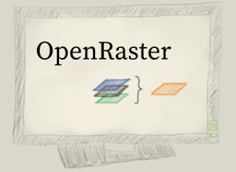

Converts multi-layered OpenRaster .ora files to PNG, JPG, or GIF.

## ORA?

[OpenRaster](https://en.wikipedia.org/wiki/OpenRaster) files consist of multiple layers, 
like .psd or .xcf files do. ORA is an open file format and is used by illustration
programs like [MyPaint](http://mypaint.org/), [Krita](https://krita.org/), and others.

## API

### .oraToImage( oraPath, pngPath, callback )

Callback is a `function( err: Object|null )`; `err` is `null` if no error occurred.

*Usage:* Direct conversion from ORA to PNG

    require( 'ora-to-image' ).oraToImage( 'test.ora', 'merged.png', err => {
        console.log( 'Success: ', !err );
    } );

### .mergeOra( oraPath, callback )

Callback is a `function( err: Object|null, img: lwipImage|null )`

*Usage:* Manual processing of the returned image (The callback function will receive a 
[Batch Image](https://github.com/EyalAr/lwip#batch-operations) from lwip, 
which can be used to further process the image.)

    require( 'ora-to-image' ).mergeOra( 'test.ora', ( err, img ) => {
        img.writeFile( 'merged.jpg' );
    } );

### .debug

Set it to `true` to enable debug log messages.

*Usage:*

    require( 'ora-to-image' ).debug = true

## Demo

An example ORA file is available in the package as `require( 'ora-to-image' ).samples.screen`,
so you can run the following command in order to generate the drawing on top:

    var oti = require( 'ora-to-image' );
    oti.mergeOra( oti.samples.screen, ( err, img ) => {
        img.writeFile( 'oraScreen.jpg' );
    } );
